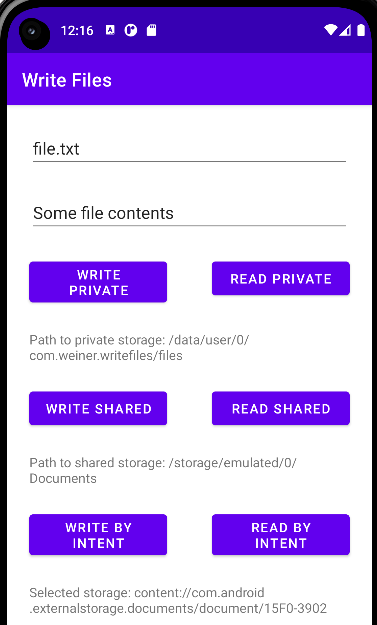

# Как писать в shared storage в Android

[Презентация](https://dmitryweiner.github.io/android-lectures/Files.html#/)

[Скомпилированное приложение](https://github.com/dmitryweiner/kotlin-write-files/raw/master/app-debug.apk)



### Запись в Private storage

```kotlin
fun writeToPrivateStorage() {
    val FILE_NAME = "file.txt"
    var fos: FileOutputStream? = null
    try {
        val text = "Какие-то данные"
        fos = openFileOutput(FILE_NAME, MODE_PRIVATE)
        fos.write(text.toByteArray())
        Toast.makeText(this, "Файл сохранен по адресу ${getFileStreamPath(FILE_NAME)}", Toast.LENGTH_SHORT)
            .show()
    } catch (ex: IOException) {
        Toast.makeText(this, ex.message, Toast.LENGTH_SHORT).show()
    } finally {
        try {
            if (fos != null) fos.close()
        } catch (ex: IOException) {
            Toast.makeText(this, ex.message, Toast.LENGTH_SHORT).show()
        }
    }
}
```

### Запись в shared storage

```kotlin
fun writeToSharedStorage() {
    val FILE_NAME = "file.txt"
    var path: File? = null
    if (Build.VERSION.SDK_INT >= Build.VERSION_CODES.R) {
        path = Environment.getExternalStoragePublicDirectory(
            // тут можно выбрать, в какой каталог писать
            Environment.DIRECTORY_DOCUMENTS
        )
    } else {
        path = Environment.getExternalStorageDirectory()
    }

    var fos: FileOutputStream? = null
    try {
        val text = "Какие-то данные"
        val file = File(path, FILE_NAME)
        file.createNewFile()
        fos = FileOutputStream(file);
        fos.write(text.toByteArray())
        Toast.makeText(
            this,
            "Файл сохранен по адресу ${file.absolutePath}",
            Toast.LENGTH_SHORT
        )
            .show()
    } catch (ex: Exception) {
        Toast.makeText(this, ex.message, Toast.LENGTH_SHORT).show()
    } finally {
        try {
            if (fos != null) fos.close()
        } catch (ex: IOException) {
            Toast.makeText(this, ex.message, Toast.LENGTH_SHORT).show()
        }
    }
}
```

### Запись с помощью интента

```kotlin
val CREATE_FILE = 1
fun writeViaIntent() {
    val FILE_NAME = "file.txt"
    val intent = Intent(Intent.ACTION_CREATE_DOCUMENT)
    intent.addCategory(Intent.CATEGORY_OPENABLE)
    intent.type = "application/txt"
    intent.putExtra(Intent.EXTRA_TITLE, FILE_NAME)
    startActivityForResult(intent, CREATE_FILE)
}

override fun onActivityResult(
    requestCode: Int, resultCode: Int, resultData: Intent?) {
    super.onActivityResult(requestCode, resultCode, resultData)
    val text = "Какие-то данные"
    if (requestCode == CREATE_FILE
        && resultCode == Activity.RESULT_OK) {
        resultData?.data?.also { uri ->
            Toast.makeText(this, "Файл сохранён: ${uri.toString()}", Toast.LENGTH_SHORT).show()
            val fos = contentResolver.openOutputStream(uri)
            fos?.write(text.toByteArray())
        }
    }
}
```
